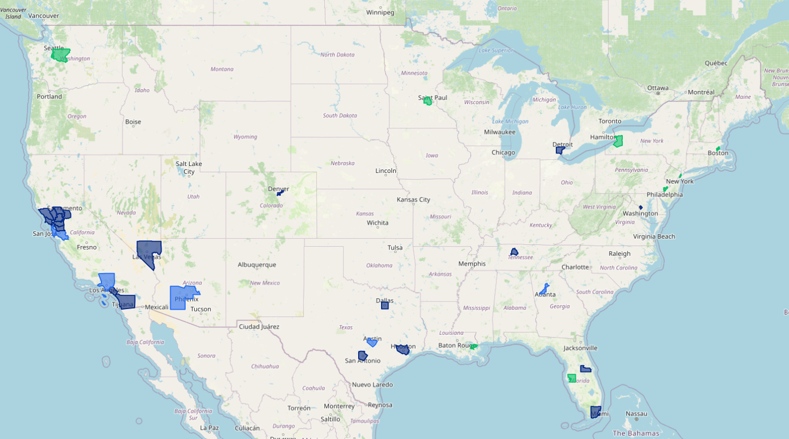

# Self-Driving Map

A visualization of self-driving vehicle zones for U.S. companies. Currently only contains data for Waymo and Zoox as only they have public commercial operations.

## Data Sources

- **Global Cities**: [geojson-world-cities](https://github.com/drei01/geojson-world-cities)
- **US Counties and States**: [us-atlas](https://github.com/topojson/us-atlas)

The `cities_with_country_state.geojson` was created with `enrich_cities.py` from `cities.geojson`. 

`av_cities_filtered.json` is a filtered version of the `cities_with_country_state.geojson` dataset built using `filter_cities.py` to lessen the client-side load.

## Modifications and Building

- Modify `operations.json` to update the shading of the map
- Run `npm run build` (dev will not update map on changes to operations.json)
- Run `npm run preview`